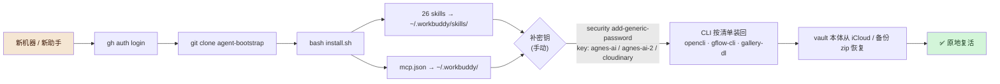

# agent-bootstrap

> **运行前资源配置（dotfiles / bootstrap）** —— 换机器、换助手（Hermes / WorkBuddy / 其他）时，拉这个仓库 + 跑一条脚本，环境原地复活。

## skills 怎么用：按链，不单独用

skills 目录是**安装单位**（平铺装进 `~/.workbuddy/skills/`），实际使用按 **[chains/REGISTRY.md](chains/REGISTRY.md)** 的链路串起来：
每条链 = 口令触发 → 按序调 skill → **文件交接**（上一步产物路径 = 下一步输入）→ 门控不过关就停。
改链路只改 REGISTRY.md 一个文件。

## 这是什么

三层内容：

1. **`skills/`** —— 我们自己写的 26 个 agent skill（`agent_created: true` + Hermes 时代自定义）。
   真源在 `~/.workbuddy/skills/`，本仓是同步备份。
2. **`mcp/mcp.json`** —— MCP server 配置（dramaclaw / reach-mcp / gflow）。真源 `~/.workbuddy/mcp.json`。
3. **`launchers/`** —— MCP 启动脚本（drama-mcp-launcher.sh）。真源 `~/Code/drama-claw-hermes/bin/`。

⛔ **密钥不进这个仓库**。所有 key 都在 macOS keychain（`security find-generic-password -a seth -s <svc> -w`），
backup 明文只在 vault `System/AI-API-清单.md`（私有库）。

## 恢复（新机器 / 新助手）



步骤明细：

```bash
git clone https://github.com/sethliao/agent-bootstrap.git && cd agent-bootstrap
bash install.sh          # 拷 skills + mcp.json 到 ~/.workbuddy/
```

然后手动补：
- keychain 写入各 API key（对照 vault `System/AI-API-清单.md`）
- 装 CLI（清单见 [CLI-清单.md](CLI-清单.md)，多数一条 npm/pip/uv 命令）
- WorkBuddy 里 Trust 自定义 MCP server

## 同步约定（改了哪边往哪边推）

- 改 skill → 改真源 `~/.workbuddy/skills/<name>/` → `bash sync.sh push`
- 拉取更新 → `bash sync.sh pull`

## 仓库可见性

**Public**（Seth 2026-10-05 拍板：去掉 API key 即可发）。密钥全在 keychain，本仓三道扫描零命中。
个别 skill 含商业打法（如 b2b-anchor-proposal），按本人意愿随仓公开。
