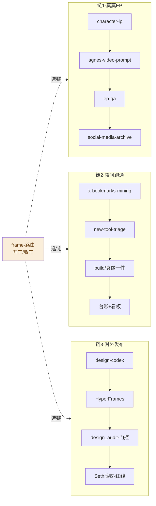

# 🔗 链注册表（Chain Registry）

> **这是什么**：skills 不单独用，按「链」串起来用。这个文件 = 唯一真源。
> **谁改**：Seth 直接改这个文件（或口述，小迪代填）。改完 `git push`，所有会话生效。
> **格式约定**：每条链一张表。**交接物** = 上一步留给下一步的文件/路径（串链靠文件交接，不靠对话记忆）。
> ⚠️ 一轮最多同时 3 个 skill 在上下文；每一环先单独跑通再串。

## 🗺 链总览

---

## 链 1 · 莫莫 EP 生产（线①）

**口令**：「开工·跑莫莫EP」 · **红线**：花 credit 前先问

| # | skill / 工具 | 干什么 | 交接物（←输入 →输出） | 门控 |
|---|---|---|---|---|
| 1 | `character-ip` | 查角色档案、一致性描述 | → 角色设定 + 参考图路径 | 档案缺项就停 |
| 2 | `agnes-video-prompt` | 写 prompt + 出片（Flash 免费） | ←参考图 → mp4（Cloudinary/本地） | prompt 先过时长/比例核对 |
| 3 | `ep-qa` | 机器体检（画幅/响度/静音） | ←mp4 → QA 报告 | 阈值 −50dB（实测标定） |
| 4 | `social-media-archive` | 成片归档进库 | ←mp4 → Assets + 索引 | — |

## 链 2 · 夜间跑通收藏（线③·自动化 `7b4f42d3` 在用）

**口令**：「你跑一下我要睡觉了」 · **红线**：零花费 · 审美归 Seth

| # | skill / 工具 | 干什么 | 交接物 | 门控 |
|---|---|---|---|---|
| 1 | `x-bookmarks-mining` | 拉收藏快照 | → JSON（data/collect/） | 只读不重抓 |
| 2 | `new-tool-triage` | A/B/C/D 分诊 | ←JSON → 分诊表 | 不重复已跑通的 |
| 3 | 真做一件 | build/装/出片 | → `runthrough/runs/<日期>-<名>/` | 一轮一个目录 |
| 4 | 台账 + 看板 | append 台账 → 刷看板 | → runthrough.html | 轮次编号先数再加 |

## 链 3 · 对外发布（线①③共用）

**口令**：「开工·发XX」 · **红线**：⛔ 草稿必须先给 Seth 过目

| # | skill / 工具 | 干什么 | 交接物 | 门控 |
|---|---|---|---|---|
| 1 | `design-codex` | 读 DESIGN.md 出视觉 | → HTML/图 | 灯红 #C8392B |
| 2 | HyperFrames | 成片/成页 | → mp4/html | — |
| 3 | `design_audit`（脚本） | AI 味指纹审计 | ←产物 → 审计分 | 分>0 修到 0 |
| 4 | Seth 验收 | 人眼终审 | → 放行/打回 | ⛔ 不过审不发 |

---

## 📝 新链模板（复制这段往下加）

**口令**： · **红线**：

| # | skill / 工具 | 干什么 | 交接物 | 门控 |
|---|---|---|---|---|
| 1 | | | | |

<!--
改完记得：git add -A && git commit -m "chains: ..." && git push
Seth 口述修改时，小迪代填并推送。
-->
